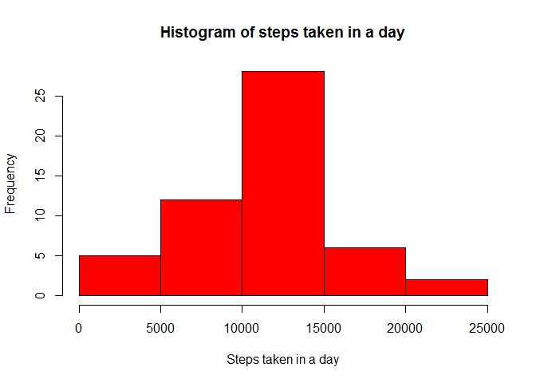
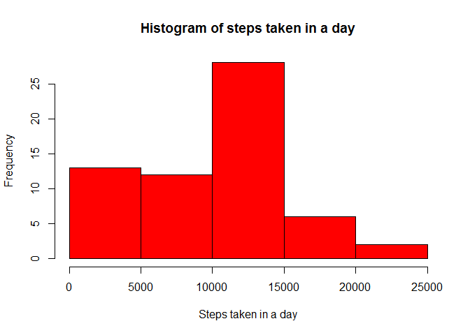
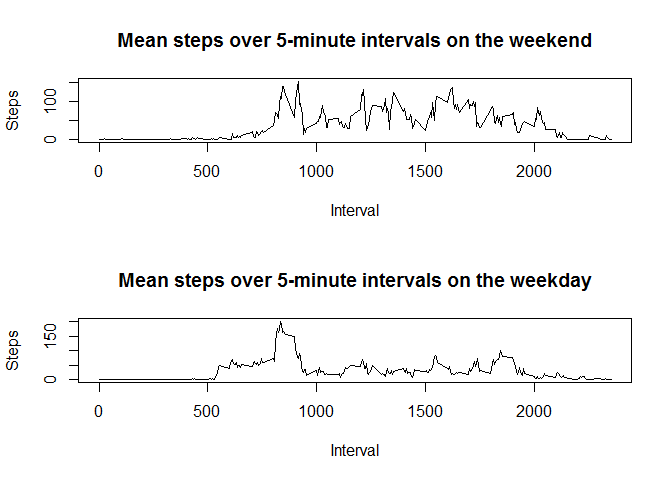

# Reproducible Research: Peer Assessment 1

##Loading and preprocessing the data
This is a R markdown file. We input activity.csv to data.  


```r
data <- read.csv("activity.csv")
data$steps <- as.numeric(data$steps)
head(data)
```

```
##   steps       date interval
## 1    NA 2012-10-01        0
## 2    NA 2012-10-01        5
## 3    NA 2012-10-01       10
## 4    NA 2012-10-01       15
## 5    NA 2012-10-01       20
## 6    NA 2012-10-01       25
```

We then create a new data frame with total number of steps taken in a day.

```r
dataProcessed <- aggregate(data$steps, by=list(date=data$date), FUN=sum)
colnames(dataProcessed)<-c("date", "steps")
dataProcessed$steps <- as.numeric(dataProcessed$steps)
```


##What is mean total number of steps taken per day?

We produce a histogram showing the total number of steps taken each day. 

```r
hist(dataProcessed$steps, col = "red", xlab = "Steps taken in a day", main = "Histogram of steps taken in a day")
```

 

```r
mea <- mean(dataProcessed$steps)
med <- median(dataProcessed$steps)
```

The mean number of steps taken in a day is NA and the median is NA

##What is the average daily activity pattern?

```r
dataUse <- data
dataUse <- dataUse[complete.cases(dataUse),]
dataInterval <- aggregate.data.frame(dataUse$steps, by=list(dataUse$interval), FUN=mean)
colnames(dataInterval)<-c("interval", "mean_interval_steps")
plot(dataInterval$interval, dataInterval$mean_interval_steps, type = "l", ylab = "Steps", xlab = "Interval")
```

 

```r
maxInterval <- dataInterval[which.max(dataInterval$mean_interval_steps), 1]
```

The Interval with the highest number of steps is 835.

##Imputing missing values
Calculate number of NAs.

```r
sum(is.na(data$steps))
```

```
## [1] 2304
```

Create a new data frame with NAs replaced with interval's mean and plot.

```r
dataNAremove <- data
dataNAremove <- merge(dataNAremove, dataInterval, by = "interval")
dataNAremove$steps[ is.na(dataNAremove$steps) ] <- dataNAremove$mean_interval_steps
```

```
## Warning in dataNAremove$steps[is.na(dataNAremove$steps)] <- dataNAremove
## $mean_interval_steps: number of items to replace is not a multiple of
## replacement length
```

```r
head(dataNAremove)
```

```
##   interval    steps       date mean_interval_steps
## 1        0 1.716981 2012-10-01            1.716981
## 2        0 0.000000 2012-11-23            1.716981
## 3        0 0.000000 2012-10-28            1.716981
## 4        0 0.000000 2012-11-06            1.716981
## 5        0 0.000000 2012-11-24            1.716981
## 6        0 0.000000 2012-11-15            1.716981
```

```r
dataProcessed2 <- aggregate(dataNAremove$steps, by=list(date=dataNAremove$date), FUN=sum)
colnames(dataProcessed2)<-c("date", "steps")
dataProcessed2$steps <- as.numeric(dataProcessed2$steps)
hist(dataProcessed2$steps, col = "red", xlab = "Steps taken in a day", main = "Histogram of steps taken in a day")
```

 

```r
mea <- mean(dataProcessed2$steps)
med <- median(dataProcessed2$steps)
```

There is very little difference between histograms.  
The new mean number of steps taken in a day is 9371.4370554 and the new median is 1.0395\times 10^{4}


##Are there differences in activity patterns between weekdays and weekends?

Create factors and plot based on factors.

```r
weekends <- c('Saturday', 'Sunday')
dataNAremove$date <- as.Date(dataNAremove$date)
dataNAremove$weekend <- factor((weekdays(dataNAremove$date) %in% weekends), levels=c(TRUE, FALSE), labels=c('weekend', 'weekday'))
dataWeekday <- subset(dataNAremove, weekend == 'weekday')
dataWeekend <- subset(dataNAremove, weekend == 'weekend')
par(mfrow = c(2,1))
dataInterval <- aggregate.data.frame(dataWeekend$steps, by=list(dataWeekend$interval), FUN=mean)
colnames(dataInterval)<-c("interval", "mean_interval_steps")
plot(dataInterval$interval, dataInterval$mean_interval_steps, type = "l", ylab = "Steps", xlab = "Interval", main = "Mean steps over 5-minute intervals on the weekend")
dataInterval <- aggregate.data.frame(dataWeekday$steps, by=list(dataWeekday$interval), FUN=mean)
colnames(dataInterval)<-c("interval", "mean_interval_steps")
plot(dataInterval$interval, dataInterval$mean_interval_steps, type = "l", ylab = "Steps", xlab = "Interval", main = "Mean steps over 5-minute intervals on the weekday")
```

 


